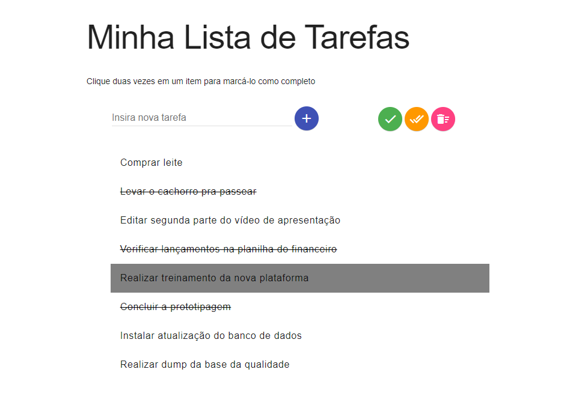

  


## 📗 Sobre

Projeto desenvolvido após as aulas de JavaScript, onde aprendemos a trabalhar com elementos, eventos e web storage.

Dois projetos foram desenvolvidos neste bloco: [**Pixels Art**](https://github.com/rafaelgeronimo/trybe-project-pixels-art) e **ToDo List**.

**Módulo**: Fundamentos do Desenvolvimento Web

**Bloco**: JavaScript: DOM, Eventos e Web Storage

## Demo

https://rafaelgeronimo.me/trybe-project-todo-list

## 🖼 Captura de tela



## 🛠 Instalação

- Realize o clone do projeto com o comando:
```bash
git clone git@github.com:rafaelgeronimo/trybe-project-todo-list.git
```
- Entre na pasta do projeto:
```bash
cd trybe-project-todo-list
```
- Não é necessário instalar o projeto, basta executar o arquivo `index.html` na raíz do mesmo, e o sistema abrirá no navegador padrão.

## 💻 Tecnologias

Este projeto foi desenvolvido com as seguintes tecnologias:


## Requisitos do projeto

### Requisitos obrigatórios

<details>
  <summary>
    1. Sua lista deve possuir o título "Minha Lista de Tarefas" em uma tag <kbd>&lt;header&gt;</kbd>. Esse título não varia de acordo com o conteúdo da lista. <em>Não confunda esse título com o título da página, que deve aparecer dentro da tag <kbd>&lt;head&gt;</kbd>.
  </summary>
  As seguintes verificações serão feitas:
  <ul>
    <li>
      Será verificado se sua página possui uma tag <kbd>header</kbd> com o conteúdo <kbd>Minha Lista de Tarefas</kbd>
    </li>
  </ul>
</details>
<details>
  <summary>
    2. Abaixo do título deve haver um pequeno e discreto parágrafo com <kbd>id="funcionamento"</kbd> e com o texto "Clique duas vezes em um item para marcá-lo como completo" explicando o funcionamento da lista para o usuário.
  </summary>
  As seguintes verificações serão feitas:
  <ul>
    <li>
      Será verificado que existe na sua página um elemento com o id <kbd>funcionamento</kbd> com o conteúdo <kbd>Clique duas vezes em um item para marcá-lo como completo</kbd>
    </li>
  </ul>
</details>
<details>
  <summary>
    3. Deve haver um <kbd>input</kbd> com o <kbd>id="texto-tarefa"</kbd> onde o usuário poderá digitar o nome do item que deseja adicionar à lista.
  </summary>
  As seguintes verificações serão feitas:
  <ul>
    <li>
      Será verificada a existência de um elemento do tipo <kbd>input</kbd> com o id <kbd>text-tarefa</kbd>.
    </li>
  </ul>
</details>
<details>
  <summary>
    4. Deve haver uma lista ordenada de tarefas com o <kbd>id="lista-tarefas</kbd>.
  </summary>
  As seguintes verificações serão feitas:
  <ul>
    <li>
      Será verificada a existência de um elemento <kbd>ol</kbd> com o id <kbd>lista-tarefas</kbd>.
    </li>
  </ul>
</details>
<details>
  <summary>
    5. Deve haver um botão com o <kbd>id="criar-tarefa"</kbd> e ao clicar nesse botão, um novo item deverá ser criado ao final da lista e o texto do input deve ser limpo.
  </summary>
  As seguintes verificações serão feitas:
  <ul>
    <li>
      Será verificada a existência de um elemento do tipo <kbd>button</kbd> com o id <kbd>criar-tarefa</kbd>
    </li>
    <li>
      No campo de input será digitado o texto de uma tarefa qualquer e, em seguida, clicar-se-á no botão de criar tarefa. Será verificado que, após o clique, o texto digitado aparece na lista e desaparece do input.
    </li>
    <li>
      A adição de elementos na lista será feita algumas vezes, e será checado se todos os itens criados permanecem na lista na medida em que novos são adicionados.
    </li>
  </ul>
</details>
<details>
  <summary>
    6. Os itens da lista de tarefas devem ser ordenados por ordem de criação.
  </summary>
  As seguintes verificações serão feitas:
  <ul>
    <li>
      Três itens serão criados na lista e será checado se eles estão ordenados por ordem de criação - ou seja, primeiro o primeiro item criado, depois o segundo, e assim por diante.
    </li>
  </ul>
</details>
<details>
  <summary>
    7. Ao clicar em um item da lista, altere a cor de fundo do item para cinza rgb(128, 128, 128).
  </summary>
  As seguintes verificações serão feitas:
  <ul>
    <li>
      Será verificado que, ao se carregar a página, os itens da lista <strong>não tem</strong> o estilo CSS <kbd>background-color: rgb(128, 128, 128)</kbd>
    </li>
    <li>
      Será verificado que, ao se clicar em um item da lista, ele passa a ter o estilo CSS <kbd>background-color: rgb(128, 128, 128)</kbd>
    </li>
  </ul>
</details>
<details>
  <summary>
    8. Não deve ser possível selecionar mais de um elemento da lista ao mesmo tempo.
  </summary>
  As seguintes verificações serão feitas:
  <ul>
    <li>
      Será verificado que, quando um elemento da lista é selecionado, o elemento selecionado previamente deixa de sê-lo. Isso é verificado através da presença ou não do estilo <kbd>background-color: rgb(128, 128, 128)</kbd> no elemento.
    </li>
  </ul>
</details>
<details>
  <summary>
    9. Ao clicar duas vezes em um item, ele deverá ser riscado, indicando que foi completo. Deve ser possível desfazer essa ação clicando novamente duas vezes no item.
  </summary>
  <pre>
  Pontos importantes sobre este requisito:
  - Crie uma classe CSS com o nome "completed" e defina a propriedade "text-decoration" com o valor "line-through".
  - Utilize a classe CSS "completed" para adicionar o efeito de letra tachada (riscada) às tarefas finalizadas.
  </pre>
  As seguintes verificações serão feitas:
  <ul>
    <li>
      Será verificado que, antes da ação ser disparada, o elemento adicionado não tem nem a classe <kbd>completed</kbd> nem o estilo <kbd>line-through solid rgb(0, 0, 0).</kbd>
    </li>
    <li>
      Será verificado que a ação pedida é disparada mediante duplo clique no elemento da lista e que os elementos da lista completos tem em sia a classe <kbd>completed</kbd> e a propriedade <kbd>text-decoration</kbd> com o valor <kbd>line-through solid rgb(0, 0, 0)
    </li>
    <li>
      Será verificado que, com um segundo duplo clique, um elemento completo deixa de sê-lo.
    </li>
  </ul>
</details>
<details>
  <summary>
    10. Deve haver um botão com o <kbd>id="apaga-tudo"</kbd> que quando clicado deve apagar todos os items da lista.
  </summary>
  As seguintes verificações serão feitas:
  <ul>
    <li>
      Será verificado que existe um elemento <kbd>button</kbd> com o id <kbd>apaga-tudo</kbd>
    </li>
    <li>
      Será verificado que, dado que uma lista possui tarefas, um clique no botão a deixa vazia.
    </li>
  </ul>
</details>
<details>
  <summary>
    11. Deve haver um botão com o <kbd>id="remover-finalizados"</kbd> que quando clicado remove somente os elementos finalizados da sua lista.
  </summary>
  As seguintes verificações serão feitas:
  <ul>
    <li>
      Será verificado que existe um elemento <kbd>button</kbd> com o id <kbd>remover-finalizados</kbd>
    </li>
    <li>
      Será verifido que, ao clicar no botão, todos os elementos marcados como feitos são removidos da lista.
    </li>
  </ul>
</details>

### Bônus

<details>
  <summary>
    12. Adicione um botão com <kbd>id="salvar-tarefas"</kbd> que salva o conteúdo da lista. Se você fechar e reabrir a página, a lista deve continuar no estado em que estava.
  </summary>
  As seguintes verificações serão feitas:
  <ul>
    <li>
      Será verificado que existe um elemento <kbd>button</kbd> com o id <kbd>salvar-tarefas</kbd>
    </li>
    <li>
      Será verificado que, quando a lista tem vários elementos, alguns dos quais marcados como finalizados, um recarregamento da página mantém a lista exatamente como está.
    </li>
  </ul>
</details>
<details>
  <summary>
    13. Adicione dois botões, um com ...
  </summary>
</details>
<details>
  <summary>
    14. Adicione um botão com ...
  </summary>
</details>